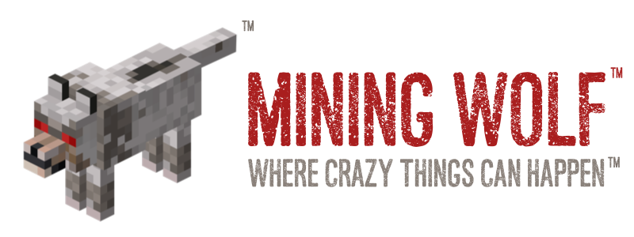

This repository contains the assets used for the Mining Wolf brand.

Please use these in any marketing or press.

Logo Red: A91E1E

Logo Beige: 776E67

Font: Asfalto

Logo:  the crazy wolf™

All original materials copyright (c) and trademark (TM) Domabo 2015, all rights reserved.

## BRAND GUIDELINES

Mining Wolf™ should have a trademark symbol the first time it appears in a creative.

Mining Wolf should generally be capitalized and is never plural or possessive.

"Mining Wolf" cannot be used in names of applications or accessory products, including phones, tablets, TVs, speakers, headphones, watches, and other devices.

Instead use "for Mining Wolf".
Incorrect: "Mining Wolf MediaPlayer"
Correct: "MediaPlayer for Mining Wolf"

If used with your logo, "for Mining Wolf" should be no larger than 90% of your logo’s size. First instance of this use should be followed by a TM symbol, "for Mining Wolf™".

Mining Wolf may be used as a descriptor, as long as it is followed by a proper generic term. (Think of "Mining Wolf" as a term used in place of "the Mining Wolf platform.")

Incorrect: "Mining Wolf MediaPlayer" or "Mining Wolf XYZ app"
Correct: "Mining Wolf features" or "Mining Wolf applications"

Where Crazy Things Can Happen™ is a trademark used only on OEM sourced materials and should not be used on derivative products.   It CAN be used on branded programming workshops under license.

Any use of the Mining Wolf name or the crazy wolf logo needs to include this attribution in your communication:

Mining Wolf is a trademark of Domabo
